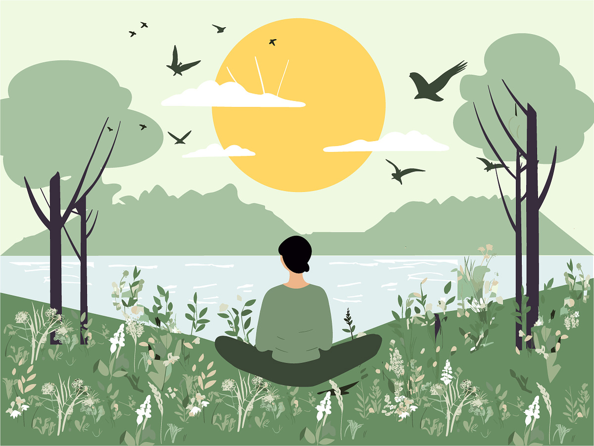

<h1 align="center">MEDITREE</h1>
<h2 align="center">"Grow Your Calm, Grow a Forest: A Meditation Website for Positive Impact"</h2>
<h3 align="justify">MediTree is a meditation website that combines mindfulness with environmental impact. Through this website, users can meditate while growing a virtual tree that represents their progress. Once the tree matures, a real tree will be planted in the user's name by our partnering NGO. This project aims to promote mental well-being and environmental sustainability simultaneously.</h3>

<ul>
  <li>This is an ongoing project made during the JIIT HACKSTREET 2.0 hackathon</li>
  <li>We have implemented our core features and are currently working on the backend integration</li>
  <li>Through this project we wish to partner with various NGOs to boost the enviornmental cause of afforestation and also promote mental wellness</li>
  <li>We will keep working on this project , add more features , and workout a production ready webapp</li>
</ul>
